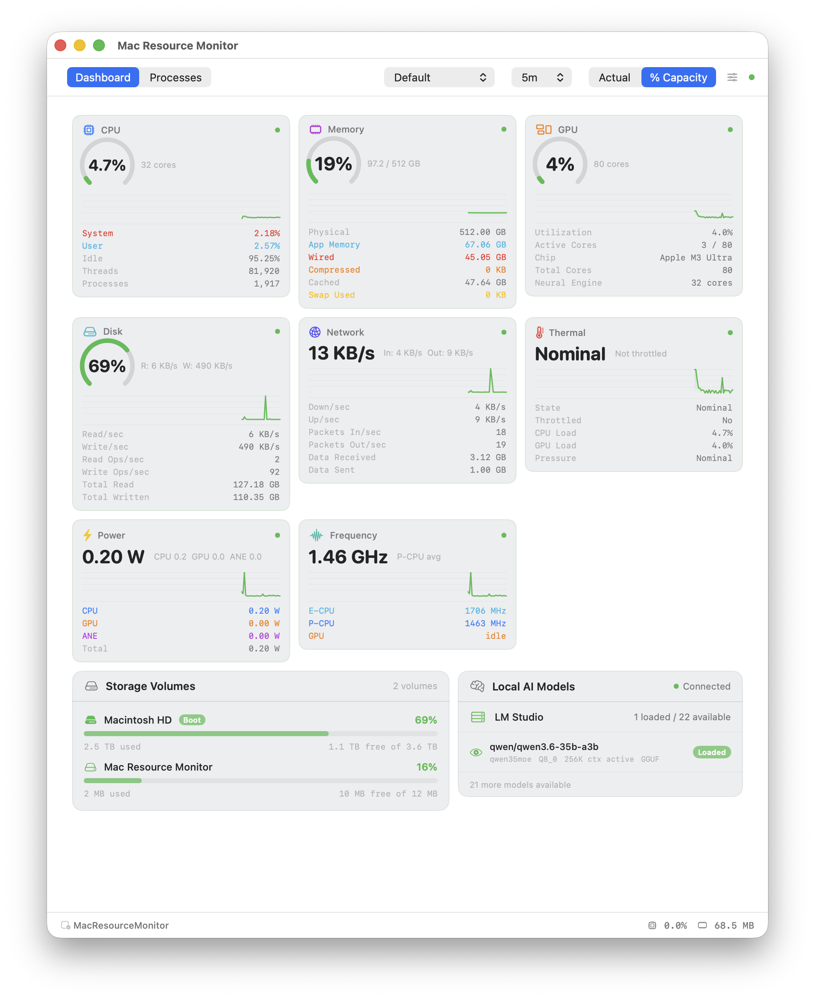
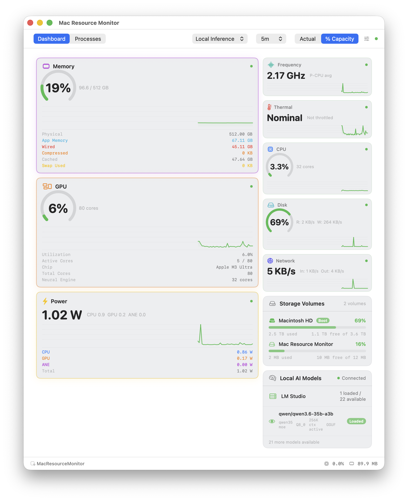

# Mac Resource Monitor

A native macOS dashboard that consolidates system resource monitoring into a single window. Built with SwiftUI for Apple Silicon Macs.

  



*Default dashboard.* Switch to the **Local Inference** profile to feature Memory, GPU, and Power for LLM workloads:



## Download

Just want to run it? Grab the latest release — no build tools required.

- **[⬇ Download MacResourceMonitor-v1.0.0.dmg](https://github.com/mikejoseph23/mac-resource-monitor/releases/download/v1.0.0/MacResourceMonitor-v1.0.0.dmg)** (recommended)
- [Download MacResourceMonitor-v1.0.0.zip](https://github.com/mikejoseph23/mac-resource-monitor/releases/download/v1.0.0/MacResourceMonitor-v1.0.0.zip)
- [All releases](https://github.com/mikejoseph23/mac-resource-monitor/releases)

Open the DMG (or unzip) and drag **Mac Resource Monitor.app** into `/Applications`. On first launch, right-click the app and choose **Open** to bypass Gatekeeper (the app is unsigned).

## Why

Activity Monitor scatters the picture across five tabs — CPU here, Memory there, Disk and Network somewhere else. Seeing *everything at once* means constant tab-switching, and sparklines reset the moment you look away.

Mac Resource Monitor consolidates it all into one always-on dashboard: CPU, memory, GPU, disk, network, thermals, and top processes on a single screen with rolling history so you can actually see trends.

It was also built with **LM Studio** (and local LLM workloads generally) in mind. When you're running a 70B model on Apple Silicon, you want to see GPU utilization, unified memory pressure, and thermal state side-by-side in real time — not tab through panes hoping to catch the spike.

## Features

- **CPU** — Per-core utilization with efficiency/performance core breakdown
- **Memory** — Active, wired, compressed, cached, and swap usage
- **GPU** — Apple Silicon GPU utilization via IOKit
- **Power** *(Apple Silicon)* — Live CPU / GPU / ANE wattage, sampled via the
  same private `IOReport` framework `powermetrics` uses. No `sudo` required.
- **Frequency** *(Apple Silicon)* — Per-cluster average MHz for E-cores,
  P-cores, and the GPU, computed from DVFS state residencies.
- **Disk I/O** — Read/write rates and volume capacity
- **Network** — Per-interface throughput (64-bit counters)
- **Processes** — Sortable process list with grouped helper processes and delta CPU tracking
- **Thermal** — System thermal state
- **LM Studio** — Optional integration for local LLM monitoring
- **Menu Bar Extra** — Compact popover with key metrics, stays running when the window is closed

No external dependencies. All metrics collected via macOS system APIs (Mach, sysctl, IOKit, IOReport).

### Apple Silicon vs Intel

The dashboard runs on Intel Macs but the **Power**, **Frequency**, and full
**GPU** sections are Apple Silicon only — they read SoC-specific channels
that don't exist on Intel hardware. CPU, memory, disk, network, and thermal
metrics work everywhere.

## Requirements

- macOS 14.0+ (Sonoma)
- Swift 5.9+
- Apple Silicon Mac (GPU metrics are tailored for Apple Silicon; CPU defaults tuned for M3 Ultra)

## Build & Run

```bash
swift build                    # Debug build
swift build -c release         # Release build
swift run MacResourceMonitor   # Run the app
```

## Project Structure

```
src/
  Models/         # Immutable metric structs and in-memory history ring buffer
  Services/       # One collector per metric type, orchestrated by MetricsManager
  Views/          # SwiftUI views — dashboard, metric cards, sparklines, process list
  Extensions/     # Swift extensions
  Resources/      # App icon
```

## How It Works

`MetricsManager` runs a 2-second timer that calls all collectors, aggregates results into a `SystemSnapshot`, and publishes via `@Published` for SwiftUI consumption. History is kept in a 300-snapshot ring buffer (~10 minutes).

## Configuration

- **GPU core count** is hardcoded to 80 in `GPUCollector.swift` for the M3 Ultra. Adjust this for your hardware.
- **No sandboxing** — the app requires unrestricted access to system APIs for full metric collection.

## Credits

The Power and Frequency sections are powered by Apple's private
`IOReport.framework`. The technique — and a lot of the channel-matching
logic in [`IOReportBridge.swift`](src/Services/IOReportBridge.swift),
[`SoCInfo.swift`](src/Services/SoCInfo.swift), and
[`PowerCollector.swift`](src/Services/PowerCollector.swift) — is adapted
from **[vladkens/macmon](https://github.com/vladkens/macmon)**, an
excellent Rust TUI for the same data. macmon is MIT-licensed; huge thanks
to [@vladkens](https://github.com/vladkens) for figuring out the
sudoless approach and documenting it well enough to port.

See also the prior art macmon credits:

- [tlkh/asitop](https://github.com/tlkh/asitop) — the original Python
  TUI; requires sudo.
- [BitesPotatoBacks/SocPowerBuddy](https://github.com/dehydratedpotato/socpowerbud)
  — Objective-C, no TUI.
- [op06072/NeoAsitop](https://github.com/op06072/NeoAsitop) — Swift port
  of asitop.

## License

MIT -- Copyright (c) 2026 [Interapp Development, Inc.](https://interappdev.com)
